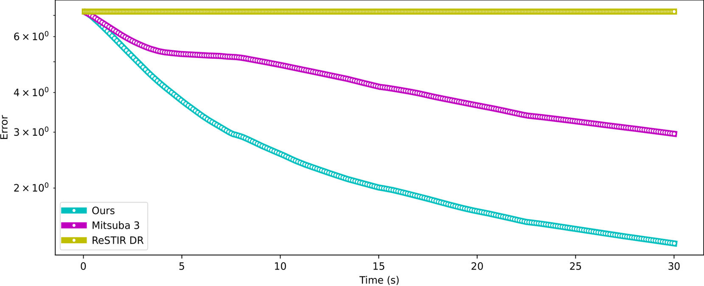

# Parameter-space ReSTIR with Global Illumination for Differentiable and Inverse Rendering

    

This fork extends [ReSTIR DR](https://weschang.com/publications/restir-dr/) to support global illumination instead of only direct lighting. Supporting global illumination is necessary to accurately recover scene parameters when the target image is not rendered with just direct lighting. This includes the case when the target image is a real photo.

Please see the original project's [webpage](https://weschang.com/publications/restir-dr/) and [repository](https://github.com/wchang22/ReSTIR_DR) for information on ReSTIR DR. In short, ReSTIR DR uses ReSTIR on the partial derivatives of texels of PBR textures to reduce the noise of the gradients, leading to overall faster convergence during inverse rendering. This project uses the same method on gradients from paths with arbitrary lengths.

This fork uses a modified version of [Mitsuba's Path Replay Backpropagation implementation ](https://mitsuba.readthedocs.io/en/stable/src/generated/plugins_integrators.html#path-replay-backpropagation-prb) to efficiently compute the gradients for paths with multiple bounces, which are then fed to the original algorithm. In addition, it uses [Random Number Replay](https://research.nvidia.com/publication/2022-07_generalized-resampled-importance-sampling-foundations-restir) to be able to replay paths of arbitrary lengths by just storing a single seed.

## Experiments
### Veach Ajar
The [Veach Ajar scene](https://mitsuba.readthedocs.io/en/stable/src/gallery.html) has its only light source behind a door. In this scene, we try to recover the albedo texture of the painting. As the image below shows, no direct lighting hits the painting, which means it is impossible to recover without considering global illumination.

    

However, our method is able to recover it despite the noisy gradients.

    

Below is a graph of the error when running the algorithms in equal time. ReSTIR DR does not change the error at all since it only considers direct lighting, which does not reach the painting. Our method improves the error faster than the baseline (Mitsuba 3) by using ReSTIR on the gradients, as described in the original paper. The baseline optimizes based on the gradients directly computed by PRB.

    

### The White Room
We also modified [The White Room scene](https://mitsuba.readthedocs.io/en/stable/src/gallery.html) to include a tire that was used in the original [ReSTIR DR paper](https://weschang.com/publications/restir-dr/). This scene also has a lot of indirect lighting as the light comes in through the windows and bounces around. The goal is to recover the roughness texture of the tire. Our method manages to outperform the baseline (Mitsuba 3) with equal time.

    

    

## Building and running
Check out the Mitsuba 3 [readme](https://github.com/mitsuba-renderer/mitsuba3) and
[docs](https://mitsuba.readthedocs.io/en/stable/src/developer_guide/compiling.html) for instructions
on compiling the project.

Please note that only the `cuda_ad_rgb` variant is supported and the project requires at least an NVIDIA
Turing GPU (e.g. RTX 2000 series+) to run.

See [notebooks/restir_gi_dr_experiments.py](notebooks/restir_gi_dr_experiments.py) for an example.

## Important files
* [src/python/python/ad/integrators/restir_gi_dr.py](src/python/python/ad/integrators/restir_gi_dr.py):
    Implementation of the differentiable rendering algorithm for global illumination
* [notebooks/restir_gi_dr_experiments.py](notebooks/restir_gi_dr_experiments.py):
    Python notebook used to run our experiments
* [scenes/](scenes/):
    Various scene files used in the original paper and our own experiments. The custom scenes for this fork were set up by https://github.com/willytrek.
